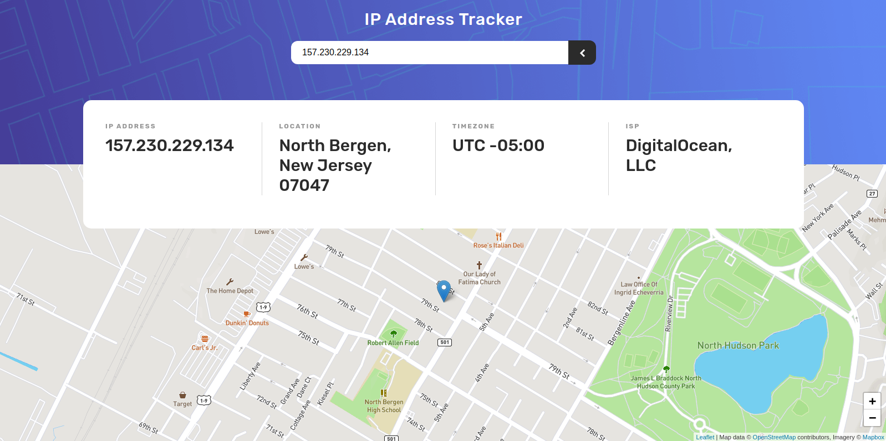

# Frontend Mentor - IP address tracker solution

This is a solution to the [IP address tracker challenge on Frontend Mentor](https://www.frontendmentor.io/challenges/ip-address-tracker-I8-0yYAH0). Frontend Mentor challenges help you improve your coding skills by building realistic projects.

## Table of contents

-   [Overview](#overview)
    -   [The challenge](#the-challenge)
    -   [Screenshot](#screenshot)
    -   [Links](#links)
-   [My process](#my-process)
    -   [Built with](#built-with)
    -   [What I learned](#what-i-learned)
-   [Author](#author)

## Overview

### The challenge

Users should be able to:

-   View the optimal layout for each page depending on their device's screen size
-   See hover states for all interactive elements on the page
-   See their own IP address on the map on the initial page load
-   Search for any IP addresses or domains and see the key information and location

### Screenshot



### Links

-   Solution URL: [Add solution URL here](https://github.com/okcomputer93/ip-address-tracker)
-   Live Site URL: [Add live site URL here](https://okcomputer93.github.io/ip-address-tracker)

## My process

### Built with

-   Semantic HTML5 markup
-   CSS custom properties
-   SCSS - Dart SASS
-   Flexbox
-   Desktop-first workflow
-   MVC Arquitecture in Frontend

### What I learned

I choose a MVC arquitecture in Javascript to organize all the components. The Model is an object loaded with info from Geo Ipify, the view are objects in charge of specific elements of the application (map, search and key info), finally the controller handle all the bussiness logic and controls the view and the requests from the model.

I implemented the logic to modify the query string of the browser from Javascript, in order to easily share results. Note: Initial searchs related to my own public ip is not inserted into the url, for security reasons.

Code I'm proud of:

```js
const handleFirstSearch = () => {
    // Render my IP and location
    // Don't add to query string my ip!
    let search = new URLSearchParams(window.location.search).getAll(
        "search"
    )[0];
    let isMyIp = false;
    if (!search) {
        isMyIp = true;
        search = "";
    }
    searchAndRender({
        isMyIp,
        searchQuery: search,
    });
};
```

```js
const modifyQueryString = (newQueryString, isMyIp) => {
    if (history.pushState && !isMyIp) {
        const newurl = `${window.location.protocol}//${window.location.host}${window.location.pathname}?search=${newQueryString}`;
        window.history.pushState({ path: newurl }, "", newurl);
    }
};
```

## Author

-   Github - [@okcomputer93](https://github.com/okcomputer93)
-   Frontend Mentor - [@okcomputer93](https://www.frontendmentor.io/profile/okcomputer93)
